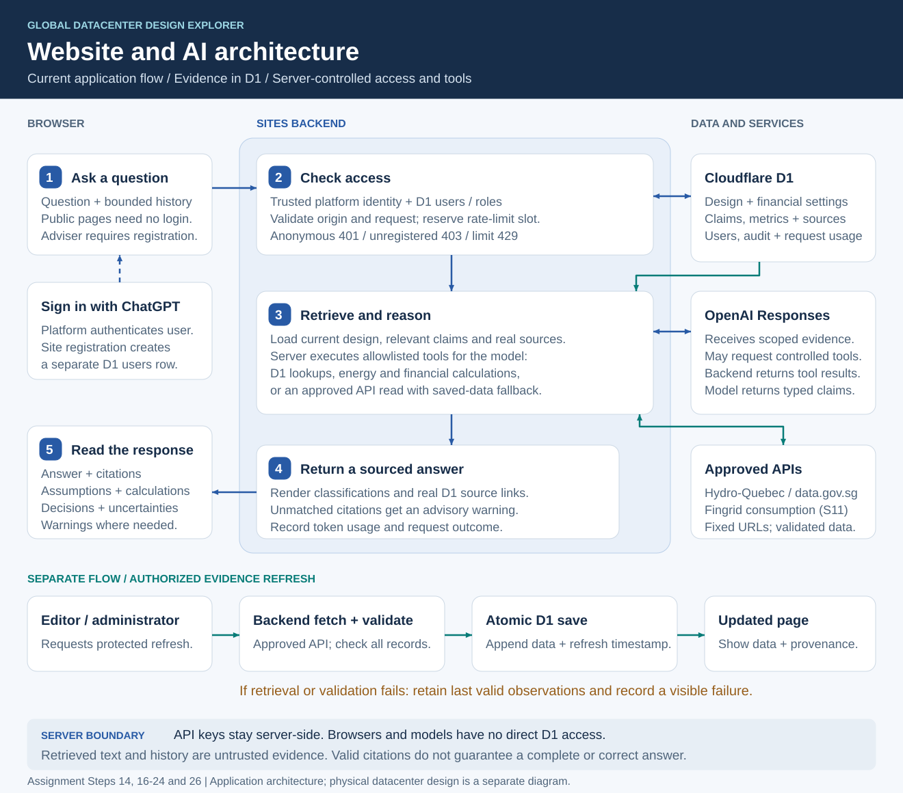

# Pset3-1.125

All future project changes belong in this directory.

- `d1-schema.sql` is the canonical working schema. Maintain this file for schema changes rather than creating versioned copies.
- `d1-schema.md` explains the schema, verified API/source mappings, and outstanding limitations.
- `api-verification.json` contains endpoint-check metadata and small response samples, not a complete imported dataset.
- `data-source.md` is the teammate's original research inventory; use the corrections and verification status in `d1-schema.md` when implementing imports.

The public Site is published at https://global-datacenter-design-explorer.tong-zhou.chatgpt.site. Source code is in `site/`; see `site/README.md` for local setup, architecture, checks and remaining limits. Cloudflare D1 backs site data and application registrations after Sign in with ChatGPT. Applied migration history must remain immutable.

The original workstation used ignored `site/.dev.vars` and production Sites Secrets for Fingrid and OpenAI. A fresh checkout has no local credentials. Never put its value in D1, Git, browser code or this documentation. Dataset 124 consumption is connected; carbon/forecast endpoint verification remains pending. The AI adviser now uses a server-side OpenAI Responses request with controlled D1/API tools, real source citations, registration checks and request limits. See `site/README.md` for Steps 18–21.

## Website and AI architecture

The browser sends adviser questions to the Sites backend, which checks identity and D1 registration, retrieves current evidence, executes controlled tools and calls OpenAI. The backend returns classified statements with real source links and records request usage. A separate authorized refresh validates approved API data before saving it; failures retain the last valid observations. API keys remain on the server.

[Open the full-size diagram](site/public/deliverables/architecture-diagram.svg) · [Download the one-page PDF](site/public/deliverables/architecture-diagram.pdf)

The public [Website Architecture page](https://global-datacenter-design-explorer.tong-zhou.chatgpt.site/architecture) includes the same diagram and a numbered, accessible request walkthrough. The addition is published in Site version 15. The separate [physical datacenter diagram](deliverables/system-diagram.pdf) covers power, cooling, networking and failure paths.

To regenerate both diagram formats, run `python3 deliverables/build_architecture.py` with `reportlab` installed. The generator uses shared drawing instructions to keep the website, README and PDF consistent.

## Repository layout

`site/` is tracked as a normal source directory in this assignment repository, so cloning the repository includes the website code. Local secrets, dependencies and build output are ignored. On the original workstation, Sites publishing history is retained separately in `.git/sites-publishing.git`, referenced by the local-only `site/.git` file; neither is uploaded to GitHub.

## Completed analysis and written deliverables

The investment model and project-management features from teammate commit `94b858c`, followed by administrator, feed and adviser fixes, architecture documentation and demonstration-video links, are published as Site version 16. Open `/investment` for cost/stress/sensitivity analysis and `/decision` for demand, country research, engineering and governance. See [completion checklist](deliverables/completion-checklist.md), [test results](deliverables/test-results.md), [financial methodology](deliverables/financial-methodology.md), [system diagram](deliverables/system-diagram.pdf), and [request-flow guide](deliverables/submission-guide.pdf). The updated investment memo is `investment-memo.docx` and has two verified pages.

The original Sites-enabled workspace completed publication and production migration 0003. The verified owner account is now team administrator. The earlier Sites/credential limitation was specific to the teammate’s workspace. Real site offers, comparable datacenter statistics, quantitative site climate, water and fiber evidence remain unresolved. The demonstration video is recorded and linked below; course submission is still pending; do not treat historical checklist exclusions as cancellation of the course requirement. See `deliverables/live-review-2026-10-05.md` for current verification scope.

## Demonstration video

[Watch the demonstration video on Google Drive](https://drive.google.com/file/d/1A_Gr7akfuBEPiqKxJvKpkcRP76397HWV/view?usp=share_link). The user provided this recorded video. Google Drive metadata confirms `pset3-video.mp4`; duration and anonymous playback access have not been independently verified.

The [Architecture page](https://global-datacenter-design-explorer.tong-zhou.chatgpt.site/architecture#request-trace) contains “One request, explained,” the worked browser → backend → D1 → OpenAI/tool → cited-response example. Each member must submit their own short explanation; the public example does not establish individual submission.
