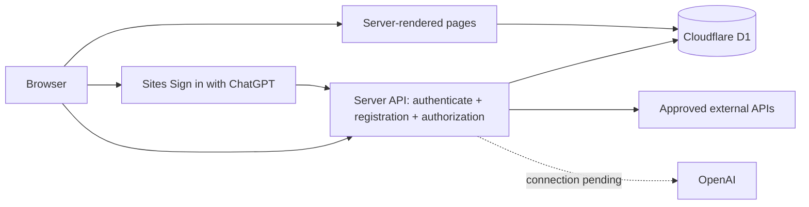

# Global Datacenter Design Explorer

An English, public-facing initial-design website for a Finnish university consortium. It compares Kajaani (Finland), Québec (Canada), and Singapore. All source and project changes stay inside `Pset3-1.125`.

## Run locally

Requires Node.js >=22.13.0 and Python 3.

```sh
npm ci
npm run build
node --import ./scripts/sites-env.mjs ./node_modules/wrangler/bin/wrangler.js d1 migrations apply DB --local --config dist/server/wrangler.json --persist-to .wrangler/state
npm run dev
```

Use the Local URL printed by the development server. The portable preview mocks Sign in with ChatGPT as `seedy@sites.test`; production uses the Sites-provided sign-in flow. Signing in identifies the visitor; a separate registration creates their D1 account.

## Storage and request flow



D1 stores countries, sources, metrics, design assumptions, calculations, decisions and application registrations. Server routes read the Sites-provided stable user identifier, then check its registration and role. New registrations receive viewer access; browser-supplied identities, roles and teams are ignored. Only registered editors in team 1 may refresh sources. No editor is provisioned automatically. Sign-in and sign-out use top-level navigation to Sites-owned routes. The application does not collect passwords or create its own login sessions. Legacy password/session columns and tables remain inactive for migration compatibility; old application cookies cannot authenticate users, and legacy accounts are not linked by email.

Seed data is inserted once, separately from schema migrations. Source imports are validated before transactional writes. Refresh failures update source status and retain saved observations.

The canonical schema is `../d1-schema.sql`. Edit that file, then run `python3 sync_schema.py` from the parent directory and `npm run db:generate` here. Keep already-applied migrations immutable. `db/schema.ts` is generated; do not maintain a separate schema by hand.

## Pages and current limits

- Overview: initial 20 MW / PUE 1.25 / 25 MW / 219 GWh baseline, recommendation, and exploratory calculator.
- Country Comparison: three countries, sourced metrics, reporting periods, units, and missing information.
- Initial Design: grid, backup, cooling, water, network concepts and classified design claims.
- Evidence: source inventory, citations, retrieval status, estimates, assumptions, calculations, decisions, and unknowns.
- Ask the Adviser: Sign in with ChatGPT, separate D1 registration, and a protected server endpoint. Actual model answers are not enabled; registered requests currently return an explicit 503 connection-pending response.

Singapore historical fuel-mix data is imported from a key-free API; its 2021 records cover January–June, not the full year. Hydro-Québec demand and generation imports are enabled, with failure status shown if retrieval is unavailable. These provincial snapshots do not establish site-specific connection capacity. Fingrid dataset 124 latest consumption is enabled using a server-side `FINGRID_API_KEY`; its national quarter-hour averages retain MWh/h units and UTC timestamps. A verified initial observation is included with its retrieval date, followed by a first-load refresh on a new database. Carbon/forecast feeds remain pending endpoint verification. Its key does not replace an OpenAI key.

There are no API keys in source or browser code. Local Cloudflare secrets use ignored `site/.dev.vars` with owner-only file permissions. Production uses Sites runtime Secrets. D1 records only the public endpoint and credential requirement, never the key. Configure future credentials as Sites runtime secrets. When enabling AI, add server-side evidence retrieval, citations, distinction between evidence/estimates/calculations/unknowns, and request limits before making model calls. The current framework does not claim FR5/FR7 substantive AI answers are complete.

Account pages: `/register`, `/login`, `/account`. Anonymous requests receive 401; signed-in users without a D1 registration receive 403; registered viewers can reach the adviser endpoint but cannot refresh evidence. The platform handles authentication; no app-owned login, logout or callback endpoint is implemented.

## Verification

```sh
node check.mjs
python3 check_runtime.py http://127.0.0.1:5173
```

2026-10-05: checks cover baseline calculations, source parsing, platform mock sign-in/sign-out, separate idempotent D1 registration, server permission checks, ignored client identities/roles and request-origin checks. Actual AI answers remain pending. The local initial import stored 68 Singapore observations; Hydro-Québec retrieval failures were visibly recorded. Fingrid authenticated server import passed previously; a rejected refresh preserved the last valid observation.
