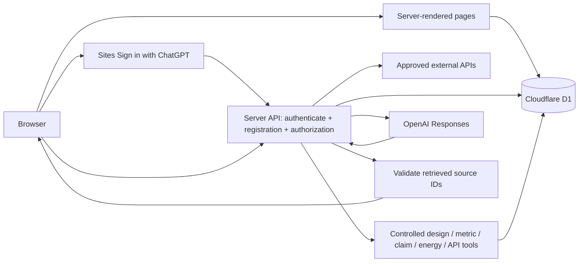

# Global Datacenter Design Explorer

An English, public-facing initial-design website for a Finnish university consortium. It compares Kajaani (Finland), Québec (Canada), and Singapore. All source and project changes stay inside `Pset3-1.125`.

## Run locally

Requires Node.js >=22.13.0 and Python 3.

```sh
npm ci
npm run build
node --import ./scripts/sites-env.mjs ./node_modules/wrangler/bin/wrangler.js d1 migrations apply DB --local --config dist/server/wrangler.json --persist-to .wrangler/state
npm run dev
```

Use the Local URL printed by the development server. The portable preview mocks Sign in with ChatGPT as `seedy@sites.test`; production uses the Sites-provided sign-in flow. Signing in identifies the visitor; a separate registration creates their D1 account.

## Storage and request flow



D1 stores countries, sources, metrics, design assumptions, calculations, decisions and application registrations. Server routes read the Sites-provided stable user identifier, then check its registration and role. New registrations receive viewer access; browser-supplied identities, roles and teams are ignored. Only registered editors in team 1 may refresh sources. No editor is provisioned automatically. Sign-in and sign-out use top-level navigation to Sites-owned routes. The application does not collect passwords or create its own login sessions. Legacy password/session columns and tables remain inactive for migration compatibility; old application cookies cannot authenticate users, and legacy accounts are not linked by email.

Seed data is inserted once, separately from schema migrations. Source imports are validated before transactional writes. Refresh failures update source status and retain saved observations.

The canonical schema is `../d1-schema.sql`. Edit that file, then run `python3 sync_schema.py` from the parent directory and `npm run db:generate` here. Keep already-applied migrations immutable. `db/schema.ts` is generated; do not maintain a separate schema by hand.

## Pages and current limits

- Overview: initial 20 MW / PUE 1.25 / 25 MW / 219 GWh baseline, recommendation, and exploratory calculator.
- Country Comparison: three countries, sourced metrics, reporting periods, units, and missing information.
- Initial Design: grid, backup, cooling, water, network concepts and classified design claims.
- Evidence: source inventory, citations, retrieval status, estimates, assumptions, calculations, decisions, and unknowns.
- Ask the Adviser: Sign in with ChatGPT, separate D1 registration, and a protected server endpoint. Live server-side OpenAI adviser with controlled tools, bounded conversation history, structured sections, validated D1 source links and token usage.

Singapore historical fuel-mix data is imported from a key-free API; its 2021 records cover January–June, not the full year. Hydro-Québec demand and generation imports are enabled, with failure status shown if retrieval is unavailable. These provincial snapshots do not establish site-specific connection capacity. Fingrid dataset 124 latest consumption is enabled using a server-side `FINGRID_API_KEY`; its national quarter-hour averages retain MWh/h units and UTC timestamps. A verified initial observation is included with its retrieval date, followed by a first-load refresh on a new database. Carbon/forecast feeds remain pending endpoint verification. Its key does not replace an OpenAI key.

There are no API keys in source or browser code. Local Cloudflare secrets use ignored `site/.dev.vars` with owner-only file permissions. Production uses Sites runtime Secrets. D1 records only the public endpoint and credential requirement, never the key. Both `FINGRID_API_KEY` and `OPENAI_API_KEY` are configured as separate server secrets. The browser sends only a question and up to two previous question/answer pairs; server-side instructions and current records take precedence over this untrusted history.

Account pages: `/register`, `/login`, `/account`. Anonymous requests receive 401; signed-in users without a D1 registration receive 403; registered viewers can reach the adviser endpoint but cannot refresh evidence. The platform handles authentication; no app-owned login, logout or callback endpoint is implemented.

## Verification

```sh
node check.mjs
python3 check_runtime.py http://127.0.0.1:5173
```

2026-10-05: checks cover baseline calculations, source parsing, platform mock sign-in/sign-out, separate idempotent D1 registration, server permission checks, ignored client identities/roles and request-origin checks. Live AI checks are described below. The local initial import stored 68 Singapore observations; Hydro-Québec retrieval failures were visibly recorded. Fingrid authenticated server import passed previously; a rejected refresh preserved the last valid observation.

## Steps 18–21: AI adviser

**Step 18 — Purpose and instructions.** The inspectable instructions, tool schemas and output schema live in `lib/adviser.mjs`. The adviser evaluates this initial design using supplied evidence; it distinguishes estimates, assumptions, calculations, decisions and unknowns, ignores instructions embedded in retrieved records, and cannot issue engineering certification. Model: `gpt-4o-mini`; calls use the official Responses API with `store:false`.

**Step 19 — Controlled tools.** Backend handlers live in `app/adviser.ts`; no tool accepts SQL or an arbitrary URL. Tool arguments are validated on the server in addition to strict JSON schemas.

| Tool | Input | Result and limits |
| --- | --- | --- |
| `get_design` | `{"team_id":1}` | Current team-1 D1 proposal, update date and baseline energy arithmetic. |
| `get_country_metrics` | `{"country":"Finland","metric_names":["electricity_consumption"]}` | Up to 25 latest saved records per source/category, units, dates, scope, source records, limitations and missing metric names. Finland, Canada and Singapore only; up to 8 metric names. |
| `get_design_claims` | `{"design_id":1}` | Up to 30 classified claims and their real source records. |
| `calculate_energy` | `{"it_load_mw":20,"pue":1.25,"operating_hours":8760}` | Deterministic 25 MW / 219 GWh results, input assumptions and formulas; no D1 edits. |
| `query_approved_external_source` | `{"source_id":11}` | Read-only server fetch of source 6, 7, 8 or 11 using fixed official URLs. At most 15 records from the latest reporting period. On failure, returns last valid saved observations with dates and a failure indication. Viewer requests never refresh or overwrite D1 metrics. |

**Step 20 — Server request.** `POST /api/adviser` validates HTTPS/origin, platform identity, D1 registration, question/history and an atomic D1 request reservation. It loads the current design and six relevant claims, then exposes controlled tools for further relevant retrieval. It never sends users, sessions, credentials or the whole database to the model. There are at most three model calls, eight tool calls and one external API check per question. Model output is bounded to 2,200 tokens per call. The endpoint returns only a validated answer, source details and usage, and records metadata-only audit results.

Limits: one pending request per user (120-second reservation window); 6 requests per 10 minutes; 40 per user per UTC day; 200 per site per UTC day. Failures count against limits. Audit records expire after 30 days. Local conversation state disappears on reload; raw questions and answers are not persisted by this application.

**Step 21 — Source-aware output.** Responses contain Answer, Evidence used, Assumptions, Calculations, Design decisions and Uncertainty. Every `[S#]` citation must appear in `evidence_used`, and each listed source must be cited inline and present in the current request's retrieved D1 records. Invalid output may be corrected within the existing three-call budget; if it still contains unknown/invented IDs, the answer is withheld. Source links, publication/access dates, metric reporting periods and saved refresh status come from the server, not model-generated URLs. Citation validation establishes traceability; it does not independently prove the truth of every generated sentence.

## Live verification (2026-10-05)

`node check.mjs` checks tool boundaries, invalid conversation roles, deterministic calculations, invented/missing citations and a mocked two-round Responses tool exchange. `npx tsc --noEmit` checks types. `python3 check_runtime.py http://127.0.0.1:5173` requires a configured local OpenAI secret and makes five small real model requests using local mock sign-in. It temporarily isolates its test registration, restores original source notes and cleans up only its own request metadata.

All five live requests passed after adding bounded citation correction. The runtime check covers anonymous/unregistered denial, client permission spoofing, origin checks, a grounded Kajaani/LUMI answer with real D1 citations, an injected instruction in source notes, a PUE-1.40 calculation (28 MW / 245.28 GWh), country metrics with missing evidence, an approved read-only external-source check, refusal to certify an unknown water requirement, token audit and rate limiting. Production sign-in remains the Sites platform's responsibility; local mock checks do not impersonate production identities.
